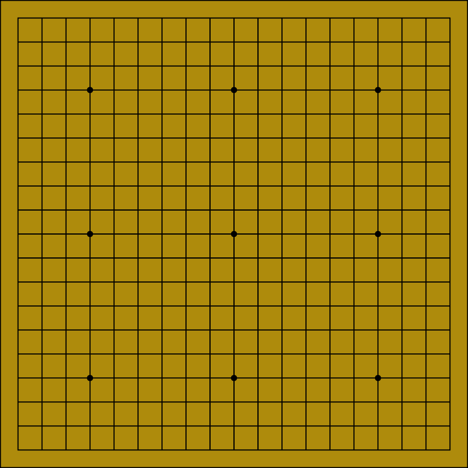

    [BLOpts]
    profile = wp
    tags =
    categories =

XXX

I want to write a few posts about the current state of computer Go.
I'm not a machine learning expert by any stretch of the imagination,
but I am a student and lover of the game.

In this post I just want to introduce you to the game of Go --- but in
a somewhat nontraditional way.  In the mid-1990s [John
Tromp](http://tromp.github.io/) and Bill Taylor developed a
formulation of the rules of Go^[The Tromp-Taylor rules are not
*precisely* equivalent to the rules that are used in competitive human
play, but they are so close as to make no difference except at a
rather advanced level.] which is succinct, logical, and lends itself
very nicely to computer implementation.   I will present the rules,
together with some of my own commentary and pictures.

1. *Go is played is on a $19 \times 19$ square grid of points, by two players
   called black and white.*

    Traditionally, a go board looks something like this:

    

    You might think this looks like an $18 \times 18$ grid.  However,
    unlike other square-grid-based games like chess, checkers, or
    Othello, the grid of points is actually taken to be the *points
    where horizontal and vertical lines intersect*, including the ones
    along the edge.  The little dots at some of the intersections are
    traditional and serve only to help orient the players; they have
    no impact on the game whatsoever.

    It is quite possible to play Go using a grid size other than $19
    \times 19$; two other common sizes are $9 \times 9$ and $13 \times
    13$.  In fact I am surprised that Tromp and Taylor decided to
    include the specific number $19$ in the rules at all. It does not
    seem to fit the spirit of the rest of the rules, which capture the
    logical core of the game but not any of the extra trappings
    regarding common or traditional practice.

    In any case, $19 \times 19$ is indeed the most common size and the
    standard for high-level play.

2. *Each point on the grid may be colored black, white or empty.*

    Traditionally, of course, the coloring of a point is represented
    by the presence of a black or white stone, or the absence of a
    stone.

3. *A point P, not colored C, is said to reach C, if there is a path
   of (vertically or horizontally) adjacent points of P's color from P
   to a point of color C.*

4. *Clearing a color is the process of emptying all points of that
   color that don't reach empty.*

5. *Starting with an empty grid, the players alternate turns, starting with Black.*

6. *A turn is either a pass; or a move that doesn't repeat an earlier
   grid coloring.*

7. *A move consists of coloring an empty point one's own color; then
   clearing the opponent color, and then clearing one's own color.*

8. *The game ends after two consecutive passes.*

9. *A player's score is the number of points of her color, plus the
   number of empty points that reach only her color.*

10. *The player with the higher score at the end of the game is the
    winner. Equal scores result in a tie.*
